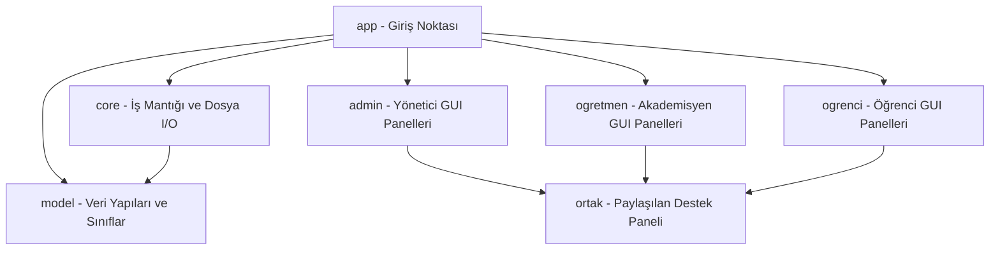

# ÖĞRENCİ BİLGİ VE YÖNETİM SİSTEMİ DETAYLI VE KAPSAMLI PROJE RAPORU

**Dersin Adı:** Bilgisayar Mühendisliği Proje Tasarımı  
**Hazırlayan:** Eren  
**Öğrenci Numarası:** [Öğrenci Numaranızı Buraya Giriniz]  
**Bölüm:** Bilgisayar Mühendisliği  
**Teslim Tarihi:** 30.05.2026  

---

## 1. ÖZET (ABSTRACT)
Bu proje kapsamında, eğitim kurumlarının idari, akademik ve haberleşme süreçlerini uçtan uca dijitalleştiren ve masaüstü platformunda çalışan modern bir **Öğrenci Bilgi ve Yönetim Sistemi** geliştirilmiştir. Java (JDK 17+) programlama dili ve Swing kütüphanesi kullanılarak inşa edilen bu sistem; Yöneticiler (Admin), Öğretim Elemanları ve Öğrenciler olmak üzere üç farklı kullanıcı rolüne göre özelleşmiş yetkilendirme sınırlarına sahiptir. Projede harici bir SQL veritabanı yönetim sistemi (RDBMS) yerine, veri tutarlılığı ve taşınabilirliği optimize edilmiş disk tabanlı dosya sistemleri (File I/O) ve Base64 simetrik şifreleme motoru entegre edilmiş bir veri depolama katmanı kurgulanmıştır.

Sistem ilk prototip aşamasındaki monolitik (God Object) tasarımından arındırılarak; Nesne Yönelimli Programlama (OOP) prensiplerine, SOLID yazılım tasarım ilkelerine ve Katmanlı Paket Mimarisine (Package-based Architecture) uygun hale getirilmiştir. Bu doğrultuda tüm arayüz bileşenleri modüler panellere ayrılmış, loose-coupling (gevşek bağlılık) ilkesini gerçekleştirmek için callback dinleyicileri (listener) tasarlanmış ve arka planda asenkron güncellemeler yapabilmek adına çoklu iş parçacığı (multithreading) mekanizması kullanılmıştır.

---

## 2. GİRİŞ
Yükseköğretim kurumlarında artan öğrenci nüfusu, akademik kadroların yönetimi, ders programlarının çakışmasız planlanması, not girişlerinin şeffaf ve hatasız hesaplanması ile öğrenci devamsızlıklarının takibi, manuel sistemlerle yönetilemeyecek seviyede karmaşık bir hale gelmiştir. Bu durum, idari süreçlerin dijital bir otomasyon sistemi altında toplanmasını zorunlu kılmaktadır.

Bu projenin temel amacı;
1. Üniversite ekosisteminin tüm idari ve akademik süreçlerini simüle etmek,
2. Öğrencilerin ders durumlarını, devamsızlık risklerini ve ders programlarını gerçek zamanlı takip etmelerini sağlamak,
3. Öğretim elemanlarının kendilerine atanan derslerin not ve devamsızlık verilerini dinamik olarak girmesine imkan tanımak,
4. Sistem yöneticisinin (Admin) tüm ekosistemi kontrol etmesini, yeni öğrenci/öğretmen tanımlamasını, ders açmasını, bölüm bazlı istatistiki analizleri görselleştirmesini ve genel duyurular yayınlamasını sağlamaktır.

Proje, yazılım mühendisliği metodolojilerine uygun olarak analiz, tasarım, refactoring ve doğrulama aşamalarından geçerek nihai kararlı haline ulaştırılmıştır.

---

## 3. GEREKSİNİM ANALİZİ VE SİSTEM MİMARİSİ

### 3.1 Fonksiyonel Gereksinimler (Functional Requirements)
*   **Rol Tabanlı Kimlik Doğrulama:** Sisteme giriş ekranında kullanıcının seçtiği role (Admin, Öğretmen, Öğrenci) göre ilgili kimlik kontrol süreçlerinin işletilmesi ve ardından kullanıcının yetki alanındaki ilgili ana ekrana ([AnaEkran](file:///c:/Users/Eren/Desktop/OgrenciYonetimSistemi/src/admin/AnaEkran.java), [OgretmenEkrani](file:///c:/Users/Eren/Desktop/OgrenciYonetimSistemi/src/ogretmen/OgretmenEkrani.java) veya [OgrenciEkrani](file:///c:/Users/Eren/Desktop/OgrenciYonetimSistemi/src/ogrenci/OgrenciEkrani.java)) yönlendirilmesi.
*   **Öğrenci Yönetimi (Admin):** Öğrenci ekleme, silme, bilgilerini (ad, bölüm, sınıf seviyesi, ortalama, şifre vb.) güncelleme, arama ve sınıf bazlı filtreleyerek listeleme işlemleri.
*   **Ders ve Öğretmen Atama (Admin):** Öğretmen ve ders tanımlama, dersi alacak öğrencilerin sınıf seviyesi ve bölümüyle dersin eşleştirilmesi ve dersi veren akademisyenle ilişkilendirilmesi.
*   **Bölüm ve Sınıf Analitiği (Admin):** Sistemdeki öğrencilerin bölümlere göre dağılımını canlı olarak hesaplayarak daire grafik (Pie Chart) ve bölümlere göre öğrenci sayılarını gösteren sütun grafik (Bar Chart) üzerinde dinamik olarak çizen görselleştirme motoru. Ayrıca üniversite genel ortalaması, en başarılı bölüm/sınıf ve en kalabalık sınıf gibi gelişmiş istatistiksel analizlerin hesaplanması.
*   **Akademik Değerlendirme (Öğretmen):** Öğretmenin verdiği derse kayıtlı olan ve dersin sınıf seviyesiyle eşleşen öğrencilerin Vize ve Final notlarının girilmesi, girilen notlardan dinamik harf notu hesaplanması.
*   **Devamsızlık Yönetimi (Öğretmen):** Öğretmenin ilgili derse yönelik öğrenci devamsızlık saatlerini kaydetmesi.
*   **Öğrenci Paneli (Öğrenci):** Kişisel profil güncelleme (TC, E-posta, Telefon, Adres), ders notlarını ve devamsızlık durumlarını listeleme, kendi bölüm ve sınıf düzeyine uygun olarak dinamik ve deterministik üretilmiş ders programını görüntüleme.
*   **Kurum İçi Haberleşme ve İletişim (Tüm Roller):** Kullanıcıların birbirlerine doğrudan mesaj gönderebilmesi (mesaj başlık ve içeriklerinin Base64 ile şifrelenmesi), gelen kutusundaki okunmamış mesajları dinamik bildirimlerle (+N) takip edebilmesi, ders bazlı duyuruların binary formatta yayınlanabilmesi ve destek talebi oluşturulması.

### 3.2 Fonksiyonel Olmayan Gereksinimler (Non-Functional Requirements)
*   **Güvenlik (Veri Gizliliği):** Kullanıcı şifrelerinin disk üzerinde açık metin (plain text) olarak saklanmasının engellenmesi. Base64 şifreleme ile veri güvenliğinin sağlanması.
*   **Performans ve Disk Yönetimi:** Dosya I/O işlemlerinde sistem kaynaklarını tüketmemek adına arabelleğe alınmış (buffered) akışların tercih edilmesi.
*   **Ölçeklenebilirlik ve Sürdürülebilirlik:** Katmanlı paket mimarisi ve nesnelerin gevşek bağlı (loose coupling) olarak tasarlanması sayesinde yeni özelliklerin kolayca entegre edilebilmesi.

### 3.3 Sistem Paket Mimarisi
Proje, mantıksal sorumluluklarına göre 7 ana pakete bölünmüştür:



*   **[app](file:///C:/Users/Eren/Desktop/OgrenciYonetimSistemi/src/app):** Sistemin başlatıcı sınıfı olan [Main.java](file:///C:/Users/Eren/Desktop/OgrenciYonetimSistemi/src/app/Main.java) dosyasını barındırır.
*   **[model](file:///C:/Users/Eren/Desktop/OgrenciYonetimSistemi/src/model):** Çekirdek nesne modellerini barındırır. `Kullanici` soyut sınıfı, `Ogrenci` ve `Ogretmen` sınıfları buradadır.
*   **[core](file:///C:/Users/Eren/Desktop/OgrenciYonetimSistemi/src/core):** Dosya okuma/yazma (CRUD) işlemlerinin yürütüldüğü, şifreleme algoritmalarının işletildiği iş mantığı katmanıdır.
*   **[admin](file:///C:/Users/Eren/Desktop/OgrenciYonetimSistemi/src/admin):** Sistem yöneticisi ekranı ve bu ekranda yer alan tüm alt sekmelerin (`AnaIslemlerPaneli`, `IstatistikPaneli`, `DersYonetimPaneli` vb.) grafiksel tasarımlarını içerir.
*   **[ogretmen](file:///C:/Users/Eren/Desktop/OgrenciYonetimSistemi/src/ogretmen):** Öğretim elemanlarının not ve devamsızlık girişi yaptığı, mesajlaştığı ekranları kapsar.
*   **[ogrenci](file:///C:/Users/Eren/Desktop/OgrenciYonetimSistemi/src/ogrenci):** Öğrencinin notlarını, ders programını, devamsızlığını ve profilini incelediği panelleri içerir.
*   **[ortak](file:///C:/Users/Eren/Desktop/OgrenciYonetimSistemi/src/ortak):** Kod tekrarını engellemek amacıyla tüm rollerin ortak kullandığı `DestekPaneli` gibi bileşenleri içerir.

---

## 4. NESNE YÖNELİMLİ PROGRAMLAMA (OOP) PRENSİPLERİ UYGULAMASI

Sistem Nesne Yönelimli Programlama (OOP) ilkelerine sıkı sıkıya bağlı kalınarak tasarlanmıştır. Bu çerçevede uygulanan temel prensipler şunlardır:

### 4.1 Kalıtım (Inheritance)
Kod tekrarını (Code Duplication) en aza indirmek ve ortak özellikleri tek bir merkezden yönetmek için `Kullanici` adında soyut bir üst sınıf oluşturulmuştur.
*   **Üst Sınıf (Superclass):** [Kullanici.java](file:///c:/Users/Eren/Desktop/OgrenciYonetimSistemi/src/model/Kullanici.java)
    ```java
    public abstract class Kullanici implements KullaniciArayuzu {
        protected String ad;
        protected String sifre;

        public Kullanici(String ad, String sifre) {
            this.ad = ad;
            this.sifre = sifre;
        }
        // ...
    }
    ```
*   **Alt Sınıflar (Subclasses):**
    *   [Ogrenci](file:///c:/Users/Eren/Desktop/OgrenciYonetimSistemi/src/model/Ogrenci.java) sınıfı `Kullanici` sınıfından türetilmiştir (`Ogrenci extends Kullanici`). Öğrenciye has okul numarası (id), bölüm, sınıf seviyesi, ortalama, adres, e-posta, telefon ve TC bilgileri bu sınıfa eklenmiştir:
        ```java
        public class Ogrenci extends Kullanici {
            private int id;
            private String bolum;
            private int sinif;
            private double ortalama;
            // ...
            public Ogrenci(int id, String sifre, String ad, String bolum, int sinif, double ortalama, String eposta, String telefon, String adres, String tc) {
                super(ad, sifre); // Üst sınıf yapıcısını çağırır
                this.id = id;
                this.bolum = bolum;
                this.sinif = sinif;
                // ...
            }
        }
        ```
    *   [Ogretmen](file:///c:/Users/Eren/Desktop/OgrenciYonetimSistemi/src/model/Ogretmen.java) sınıfı `Kullanici` sınıfından türetilmiştir (`Ogretmen extends Kullanici`). Öğretmene has TC kimlik numarası (tcKimlik) ve verdiği ders (verilenDers) özellikleri eklenmiştir.

### 4.2 Soyutlama (Abstraction)
[Kullanici](file:///C:/Users/Eren/Desktop/OgrenciYonetimSistemi/src/model/Kullanici.java) sınıfı `abstract` olarak deklare edilmiştir. Bu sayede programın herhangi bir yerinde `new Kullanici(...)` şeklinde soyut, rolü belirsiz bir nesne oluşturulması engellenmiştir. Soyutlama sayesinde sisteme giriş yapacak aktörlerin sahip olması gereken temel iskelet çizilmiştir.

### 4.3 Çok Biçimlilik (Polymorphism)
[KullaniciArayuzu](file:///C:/Users/Eren/Desktop/OgrenciYonetimSistemi/src/model/KullaniciArayuzu.java) isimli bir arayüz (Interface) tanımlanmış ve içerisine `void bilgileriGoster()` imza metodu eklenmiştir.    
*   `Kullanici` sınıfı bu arayüzü implemente eder.
*   [Ogrenci](file:///C:/Users/Eren/Desktop/OgrenciYonetimSistemi/src/model/Ogrenci.java) sınıfı `bilgileriGoster` metodunu override ederek:
    ```java
    @Override
    public void bilgileriGoster() {
        System.out.println("Öğrenci: " + ad + " - Bölüm: " + bolum);
    }
    ```
*   [Ogretmen](file:///C:/Users/Eren/Desktop/OgrenciYonetimSistemi/src/model/Ogretmen.java) sınıfı aynı metodu override ederek:
    ```java
    @Override
    public void bilgileriGoster() {
        System.out.println("Öğretmen: " + ad + " - Ders: " + verilenDers);
    }
    ```
    şeklinde kendi davranışını sergiler. Bu durum, çalışma zamanında (Runtime) çok biçimliliğin başarılı bir örneğidir.

### 4.4 Kapsülleme (Encapsulation)
Veri güvenliğini ve bütünlüğünü korumak adına tüm üye değişkenler `private` (veya kalıtım hiyerarşisi için `protected`) erişim belirleyicileri ile tanımlanmıştır. Sınıf dışından bu değişkenlere doğrudan erişim engellenmiş, okuma ve yazma yetkileri kontrollü bir şekilde `Getter` ve `Setter` metotları ile sağlanmıştır.

Örneğin, [Ogrenci](file:///c:/Users/Eren/Desktop/OgrenciYonetimSistemi/src/model/Ogrenci.java) sınıfında üye değişkenler gizlenmiş ve erişim metotlarla sınırlandırılmıştır:
```java
public class Ogrenci extends Kullanici {
    private int id;
    private double ortalama;
    private int sinif;

    // Getter & Setter
    public int getId() { return id; }
    public void setId(int id) { this.id = id; }

    public double getOrtalama() { return ortalama; }
    public void setOrtalama(double ortalama) { this.ortalama = ortalama; }

    public int getSinif() { return sinif; }
    public void setSinif(int sinif) { this.sinif = sinif; }
}
```
Bu sayede, `Ogrenci` nesnesinin verileri kontrolsüz dış müdahalelerden korunmuş olur.

---

## 5. DOSYA TABANLI VERİTABANI VE VERİ YAPILARI ŞEMASI

Uygulamada harici bir veritabanı kurulumuna ihtiyaç duyulmaması amacıyla, projenin ana dizininde `;` (noktalı virgül) ayracı ile yapılandırılmış CSV (Comma-Separated Values) benzeri düz metin dosyaları ve binary dosyalar kullanılmıştır.

### 5.1 `ogrenciler.txt` Şeması
Öğrenci kayıtlarının saklandığı dosyadır. Şema yapısı aşağıdaki gibidir:
`ID;Şifre(Base64);Ad Soyad;Bölüm;Ortalama;E-Posta;Telefon;Adres;TC;Sınıf`
*   *Örnek Satır:* `250260001;MTIzNDU2;Ahmet Yılmaz;Bilgisayar Mühendisliği;3.15;ahmet@edu.tr;05551112233;İstanbul;11111111110;2`

### 5.2 `ogretmenler.txt` Şeması
Öğretmenlerin kimlik ve ders bilgilerini tutar:
`TCKimlik;Şifre(Base64);Ad Soyad;VerilenDers`
*   *Örnek Satır:* `22222222220;YWNhZGVtaXN5ZW4=;Prof. Dr. Ayşe Yılmaz;Programlama I`

### 5.3 `notlar.txt` Şeması
Öğrencilerin aldıkları derslerin vize ve final notlarını saklar:
`OgrenciID;DersAdi;VizeNotu;FinalNotu`
*   *Örnek Satır:* `250260001;Programlama I;80;90`

### 5.4 `devamsizlik.txt` Şeması
Öğrencilerin ders bazlı devamsızlık saatlerini tutar:
`OgrenciID;DersAdi;DevamsizlikSaati`
*   *Örnek Satır:* `250260001;Programlama I;4`

### 5.5 `mesajlar.txt` Şeması
Sistem içindeki kullanıcıların birbirlerine gönderdiği mesajları saklar. Mesajların gizliliğini korumak amacıyla mesaj başlığı ve içeriği disk üzerinde Base64 algoritması ile şifrelenmiş olarak saklanır:
`GonderenKullanici;AliciKullanici;MesajBasligi(Base64);MesajIcerigi(Base64)`
*   *Örnek Satır:* `Prof. Dr. Ayşe Yılmaz;250260001;w5ZkZXYgVGVzbGltaQ==;w5ZkZXZsZXJpbml6aSBwYXphcnRlc2kgZ8O8bsO8bmUga2FkYXIgdGFtYW1sYXnEsW7EsXou`

### 5.6 `duyurular.dat` Şeması
Bölüm bazlı ve genel duyuruların saklandığı binary dosya formatıdır. Java'nın `RandomAccessFile` ve `writeUTF`/`readUTF` metotları kullanılarak yazılır ve okunur.
`Bölüm/Genel;DuyuruBaşlığı - Duyuruİçeriği`

---

## 6. SİSTEMDE KULLANILAN ALGORİTMALAR VE İŞ MANTIKLARI

Proje kapsamında geliştirilen karmaşık iş mantıkları ve matematiksel modeller aşağıda algoritmik detaylarıyla açıklanmıştır.

### 6.1 Base64 Güvenlik ve Şifreleme Algoritması
Sistemin veritabanı dosya tabanlı olduğu için şifrelerin ve kullanıcılar arası özel mesajlaşmaların açık metin (plain-text) olarak diskte durması güvenlik açığı oluşturacaktır. Bu sebeple `java.util.Base64` sınıfı kullanılarak simetrik kodlama/kod çözme algoritması entegre edilmiştir. Bu şifreleme algoritması hem kullanıcıların şifrelerinin (`ogrenciler.txt` ve `ogretmenler.txt`) hem de sistem içi haberleşme mesajlarının konu ve içeriklerinin (`mesajlar.txt`) diskte güvenle saklanmasını sağlar.

*   **Şifreleme Algoritması (`sifrele`):**
    Girdi olarak alınan düz metin (şifre, mesaj başlığı veya içeriği), UTF-8 karakter setine göre byte dizisine dönüştürülür ve Base64 algoritması ile encode edilerek string şeklinde ilgili veri dosyasına yazılır.
    $$\text{Şifreleme: } f(s) = \text{Base64Encode}(s_{\text{bytes}})$$
*   **Şifre Çözme Algoritması (`sifreCoz`):**
    Dosyadan okunan Base64 formatındaki kodlanmış metin byte dizisine decode edilir, ardından tekrar UTF-8 standardında düz metne dönüştürülerek RAM'e veya arayüz bileşenlerine aktarılır.
    $$\text{Deşifreleme: } f^{-1}(e) = \text{Base64Decode}(e_{\text{bytes}})$$

[OgrenciYonetici](file:///c:/Users/Eren/Desktop/OgrenciYonetimSistemi/src/core/OgrenciYonetici.java) sınıfında yer alan ilgili metotlar:
```java
public static String sifrele(String sifre) {
    return Base64.getEncoder().encodeToString(sifre.getBytes(StandardCharsets.UTF_8));
}

public static String sifreCoz(String sifreliMetin) {
    try {
        byte[] decoded = Base64.getDecoder().decode(sifreliMetin);
        return new String(decoded, StandardCharsets.UTF_8);
    } catch (IllegalArgumentException e) {
        return sifreliMetin; // Eski düz metin kayıtlar için geriye dönük uyumluluk
    }
}
```

---

### 6.2 Dinamik Akademik Dönem Hesaplama Algoritması
Öğretmen ekranındaki [NotGirisPaneli](file:///C:/Users/Eren/Desktop/OgrenciYonetimSistemi/src/ogretmen/NotGirisPaneli.java) başlatılırken, sisteme o anki tarih bilgisini veren `LocalDate.now()` çağrısı yapılarak içinde bulunulan akademik dönem dinamik olarak tespit edilir.

**Dönem Belirleme Karar Mekanizması:**
*   **Eylül (9) - Ocak (1) Ayları Arası:** Güz Dönemi
    *   Eğer içinde bulunulan ay Eylül veya sonrası ise akademik yıl `yil` ile başlar. Eğer Ocak ise akademik yıl bir önceki yıla (`yil - 1`) aittir.
*   **Şubat (2) - Haziran (6) Ayları Arası:** Bahar Dönemi
*   **Temmuz (7) - Ağustos (8) Ayları Arası:** Yaz Dönemi

[OgretmenEkrani](file:///C:/Users/Eren/Desktop/OgrenciYonetimSistemi/src/ogretmen/OgretmenEkrani.java) içerisindeki kod algoritması:
```java
private String donemBelirle() {
    LocalDate tarih = LocalDate.now();
    int ay = tarih.getMonthValue();
    int yil = tarih.getYear();
    
    if (ay >= 9 || ay == 1) {
        int egitimYili = ay >= 9 ? yil : (yil - 1);
        return egitimYili + "-" + (egitimYili + 1) + " Güz Dönemi";
    } else if (ay >= 2 && ay <= 6) {
        return (yil - 1) + " - " + yil + " Bahar Dönemi";
    } else {
        return (yil - 1) + " - " + yil + " Yaz Dönemi";
    }
}
```

---

### 6.3 Deterministik Ders Programı Oluşturma Algoritması
Öğrencinin ders programı disk üzerinde statik bir dosyada saklanmaz. Bellek optimizasyonu amacıyla, öğrencinin kayıtlı olduğu bölüme göre dinamik ve deterministik bir şekilde üretilir. 

**Çalışma Mantığı:**
1. [OgrenciDersProgramiPaneli](file:///C:/Users/Eren/Desktop/OgrenciYonetimSistemi/src/ogrenci/OgrenciDersProgramiPaneli.java) nesnesi kurulurken `dersler.txt` dosyasından öğrencinin bölümüne ait tüm dersler filtrelenerek okunur.
2. Java'nın `java.util.Random` sınıfı, öğrencinin bölüm adının hash koduyla (`bolum.hashCode()`) tohumlanır (seeded).
   $$\text{Seed} = \text{hashCode}(\text{bolum})$$
3. Bu tohumlama sayesinde, **aynı bölümde okuyan tüm öğrencilerin ders programları tamamen aynı ve çakışmasız gün/saat/derslik eşleşmelerine sahip olurken**, farklı bölümdeki öğrencilerin ders programları farklı gün ve saatlere rastgele ama tutarlı olarak dağıtılır.
4. Program her açıldığında aynı tohum kullanıldığı için veriler rastgele değişmez, kararlı kalır.

Algoritmanın Java uygulaması:
```java
String[] dersler = bolumeGoreDersleriGetir(ogrenci.getBolum());
String[] gunler = {"Pazartesi", "Salı", "Çarşamba", "Perşembe", "Cuma"};
String[] saatler = {"09:00 - 11:00", "11:00 - 13:00", "13:00 - 15:00", "15:00 - 17:00"};

// Bölüm adına özel deterministik tohum oluşturuluyor
Random rastgele = new Random(ogrenci.getBolum().hashCode()); 

for (int i = 0; i < dersler.length; i++) {
    String gun = gunler[rastgele.nextInt(gunler.length)];
    String saat = saatler[rastgele.nextInt(saatler.length)];
    String derslik = "Amfi " + (1 + rastgele.nextInt(5)); 
    model.addRow(new Object[]{gun, saat, dersler[i], derslik});
}
```

---

### 6.4 Ağırlıklı Not Ortalaması ve Harf Notu Algoritması
Uygulamada bir öğrencinin ders başarısı, vize notunun %40'ı ile final notunun %60'ının ağırlıklı toplamı ile hesaplanır.

$$\text{Başarı Notu} = (\text{Vize Notu} \times 0.4) + (\text{Final Notu} \times 0.6)$$

Not girişi esnasında [NotGirisPaneli](file:///c:/Users/Eren/Desktop/OgrenciYonetimSistemi/src/ogretmen/NotGirisPaneli.java) veya not listeleme ekranında [OgrenciNotPaneli](file:///c:/Users/Eren/Desktop/OgrenciYonetimSistemi/src/ogrenci/OgrenciNotPaneli.java) üzerinde bu başarı notu hesaplanır ve karşılık gelen harf notu deterministik olarak belirlenir:

| Başarı Notu Aralığı | Harf Notu |
| :--- | :---: |
| $\ge 85$ | **AA** |
| $[75, 85)$ | **BA** |
| $[65, 75)$ | **BB** |
| $[55, 65)$ | **CB** |
| $[50, 55)$ | **CC** |
| $[40, 50)$ | **DC** |
| $< 40$ | **FF** |

**Proje İçindeki Kod Uygulaması:**
[OgrenciNotPaneli.java](file:///c:/Users/Eren/Desktop/OgrenciYonetimSistemi/src/ogrenci/OgrenciNotPaneli.java) içindeki not ağırlık hesabı ve harf notu belirleme metotları şöyledir:
```java
// Ağırlıklı not hesaplama örneği
double dersOrtalamasi = (vizeNotu * 0.4) + (finalNotu * 0.6);

// Harf notu eşleştirme algoritması
private String harfNotuHesapla(double ortalama) {
    if (ortalama >= 85) return "AA";
    else if (ortalama >= 75) return "BA";
    else if (ortalama >= 65) return "BB";
    else if (ortalama >= 55) return "CB";
    else if (ortalama >= 50) return "CC";
    else if (ortalama >= 40) return "DC";
    else return "FF";
}
```

---

### 6.5 Çapraz Dosya Kontrolü ve Devamsızlık Risk Analizi
Öğrencinin not durumu listelenirken sistem sadece `notlar.txt` dosyasını okumakla kalmaz, arka planda `devamsizlik.txt` dosyasıyla **çapraz sorgulama** (Cross-file validation) gerçekleştirir.

**İş Akış Şeması:**
```
[notlar.txt Okunuyor] ──> Öğrencinin aldığı dersler tespit ediliyor
                              │
                              ▼
[devamsizlik.txt Sorgulanıyor] ──> İlgili derse ait devamsızlık saati alınıyor
                              │
                              ├─> Eğer Devamsızlık Saati >= 8 ise:
                              │   Ortalama ne olursa olsun Harf Notu = "DZ"
                              │
                              └─> Eğer Devamsızlık Saati < 8 ise:
                                  Harf Notu = harfNotuHesapla(ortalama)
```

[OgrenciDevamsizlikPaneli](file:///c:/Users/Eren/Desktop/OgrenciYonetimSistemi/src/ogrenci/OgrenciDevamsizlikPaneli.java) sınıfında ise öğrencinin devamsızlık durumuna göre akademik risk analizi yapılır. Toplam devamsızlık sınırı **8 saat** olarak belirlenmiştir. Kalan devamsızlık hakkı hesaplanarak durum analizi şu formülle belirlenir:

*   $\text{Devamsızlık Saati} \ge 8 \implies \text{DURUM: DEVAMSIZLIKTAN KALDI}$
*   $6 \le \text{Devamsızlık Saati} < 8 \implies \text{DURUM: RİSKLİ}$
*   $\text{Devamsızlık Saati} < 6 \implies \text{DURUM: İYİ}$

**Proje İçindeki Kod Uygulaması:**
[OgrenciNotPaneli.java](file:///c:/Users/Eren/Desktop/OgrenciYonetimSistemi/src/ogrenci/OgrenciNotPaneli.java) ve [OgrenciDevamsizlikPaneli.java](file:///c:/Users/Eren/Desktop/OgrenciYonetimSistemi/src/ogrenci/OgrenciDevamsizlikPaneli.java) içerisindeki çapraz sorgu ve risk analizi kontrol mekanizmaları şu şekildedir:
```java
// OgrenciNotPaneli.java - Not ve devamsızlık çapraz kontrolü
int yapilanDevamsizlik = dersinDevamsizliginiGetir(ogrenci, dersAdi); 
double dersOrtalamasi = (vizeNotu * 0.4) + (finalNotu * 0.6);
String harfNotu;

if (yapilanDevamsizlik >= 8) {
    harfNotu = "DZ"; // Devamsızlıktan kaldı
} else {
    harfNotu = harfNotuHesapla(dersOrtalamasi);
}

// OgrenciDevamsizlikPaneli.java - Kalan hak ve risk analizi hesabı
int devamsizlikSiniri = 8;
int kalanHak = devamsizlikSiniri - yapilanDevamsizlik;
if (kalanHak < 0) kalanHak = 0; 

String durum = "";
if (yapilanDevamsizlik >= 8) {
    durum = "DEVAMSIZLIKTAN KALDI";
} else if (yapilanDevamsizlik >= 6) { 
    durum = "RİSKLİ";
} else {
    durum = "İYİ";
}
```

---

### 6.6 İstatistiksel Bölüm Analizi Algoritması
Admin panelindeki [IstatistikPaneli](file:///c:/Users/Eren/Desktop/OgrenciYonetimSistemi/src/admin/IstatistikPaneli.java) yüklendiğinde veya güncellendiğinde, sistemde kayıtlı olan tüm öğrencilerin verileri taranarak dinamik olarak bölüm ve sınıf bazlı istatistikler hesaplanır.

**Algoritmanın İşleyişi:**
Veriler `HashMap` yapıları kullanılarak tek bir döngüde $O(N)$ zaman karmaşıklığıyla analiz edilir. Bu döngüde bölümlerin genel not ortalamaları, öğrenci sayıları, bölüm-sınıf dağılımları ve genel üniversite ortalaması eşzamanlı olarak hesaplanır.

**Proje İçindeki Kod Uygulaması:**
[IstatistikPaneli.java](file:///c:/Users/Eren/Desktop/OgrenciYonetimSistemi/src/admin/IstatistikPaneli.java) içerisindeki tarama ve hesaplama döngüsü aşağıdaki gibidir:
```java
// Bölüm ve sınıf bazlı istatistiklerin tek döngüde hesaplanması
Map<String, ArrayList<Double>> bolumNotlari = new HashMap<>();
Map<String, ArrayList<Double>> bolumSinifNotlari = new HashMap<>();
Map<Integer, ArrayList<Double>> sinifNotlari = new HashMap<>();
Map<Integer, Integer> sinifOgrenciSayilari = new HashMap<>();

for (Ogrenci ogr : yonetici.getOgrenciListesi()) {
    toplamOgrenci++;
    toplamOrtalama += ogr.getOrtalama();
    
    // Bölüm not listesi
    String bolum = ogr.getBolum();
    bolumNotlari.putIfAbsent(bolum, new ArrayList<>());
    bolumNotlari.get(bolum).add(ogr.getOrtalama());
    
    // Bölüm - Sınıf not listesi
    String bolumSinif = bolum + " - " + ogr.getSinif() + ". Sınıf";
    bolumSinifNotlari.putIfAbsent(bolumSinif, new ArrayList<>());
    bolumSinifNotlari.get(bolumSinif).add(ogr.getOrtalama());
    
    // Sınıf not listesi ve öğrenci sayısı
    int sinif = ogr.getSinif();
    sinifNotlari.putIfAbsent(sinif, new ArrayList<>());
    sinifNotlari.get(sinif).add(ogr.getOrtalama());
    sinifOgrenciSayilari.put(sinif, sinifOgrenciSayilari.getOrDefault(sinif, 0) + 1);
}
```

Döngünün ardından her bölümün veya sınıfın ortalaması, toplam notunun ilgili eleman sayısına bölünmesiyle (`ortalama = toplam / kisiSayisi`) elde edilir ve analiz kartlarına yansıtılır.

---

### 6.7 Daire Grafik (Pie Chart) Çizim Algoritması
[DaireGrafikPaneli](file:///c:/Users/Eren/Desktop/OgrenciYonetimSistemi/src/admin/DaireGrafikPaneli.java), Java'nın `paintComponent(Graphics g)` metodunu override ederek kendi çizim motorunu barındırır. Graphics2D nesnesi ile bölümlerin öğrenci dağılımlarını daire dilimleri olarak çizer.

**Açı Hesaplama Formülü:**
Her bir bölüm için çizilecek daire diliminin açısı ($\theta_i$), o bölümdeki öğrenci sayısının ($s_i$) toplam öğrenci sayısına ($S$) oranının 360 derece ile çarpılmasıyla hesaplanır.
$$\theta_i = \text{round}\left( \frac{s_i}{S} \times 360 \right)$$

**Proje İçindeki Kod Uygulaması:**
[DaireGrafikPaneli.java](file:///c:/Users/Eren/Desktop/OgrenciYonetimSistemi/src/admin/DaireGrafikPaneli.java) içindeki grafik çizim ve açı akümülasyon kod yapısı şu şekildedir:
```java
@Override
protected void paintComponent(Graphics g) {
    super.paintComponent(g);
    Graphics2D g2d = (Graphics2D) g;
    // çizimin kusuurlu olmaması için
    g2d.setRenderingHint(RenderingHints.KEY_ANTIALIASING, RenderingHints.VALUE_ANTIALIAS_ON);

    int cap = Math.min(getWidth() / 2 - 20, getHeight() - 60);
    int x = 30;
    int y = (getHeight() - cap) / 2;  
    
    int baslangicAcisi = 0;
    for (int i = 0; i < etiketler.size(); i++) {
        double sayi = degerler.get(i);
        int aci = (int) Math.round((sayi / toplam) * 360);
        
        // Son dilimin tam kapanmasını sağlama
        if (i == etiketler.size() - 1) {
            aci = 360 - baslangicAcisi;
        }
        
        g2d.setColor(renkler[i % renkler.length]);
        g2d.fillArc(x, y, cap, cap, baslangicAcisi, aci); // Dilimin çizimi
        baslangicAcisi += aci; // Bir sonraki dilimin başlangıç açısı
    }
    
}
```
     ---

### 6.8 Sınıf-Ders Eşleşmesi ve Bölüm İçi Sınıf Yetkilendirmesi Algoritması
Öğrencilerin akademik takipleri ve ders programları, sisteme eklenen `sinif` (1-4 arası lisans yılları) özniteliği aracılığıyla filtrelenmektedir. Ders programı ve not/devamsızlık giriş ekranları oluşturulurken öğrencinin hem ilgili bölüme kayıtlı olması hem de dersin atandığı sınıf seviyesinde bulunması şartı aranır.

**Algoritmanın Çalışma Mantığı:**
1. [OgrenciDersProgramiPaneli](file:///c:/Users/Eren/Desktop/OgrenciYonetimSistemi/src/ogrenci/OgrenciDersProgramiPaneli.java) panelinde ders programı çizili   rken `bolumeVeSinifaGoreDersleriGetir(ogrenci.getBolum(), ogrenci.getSinif())` fonksiyonu çağrılır.
2. Bu fonksiyon `dersler.txt` dosyasındaki her satırı çözümler:
   * Satır formatı: `Bölüm;Sınıf;Ders;Öğretmen` dersl
   * Eğer dersin bölümü öğrencinin bölümüyle ve dersin sınıf seviyesi öğrencinin sınıf seviyesiyle eşleşirse ders listeye dahil edilir.
3. Ders programındaki gün/saat/derslik atamaları deterministik olarak üretilir. Bu aşamada tohum değeri olarak bölüm hash kodu ile öğrenci sınıf derecesi toplanır:
   $$\text{Seed} = \text{hashCode}(\text{bolum}) + \text{sinif}$$
   Böylece aynı bölüm ve aynı sınıftaki tüm öğrencilerin ders programları birebir aynı üretilerek çakışmalar engellenir.

**Proje İçindeki Kod Uygulaması:**
[OgrenciDersProgramiPaneli.java](file:///c:/Users/Eren/Desktop/OgrenciYonetimSistemi/src/ogrenci/OgrenciDersProgramiPaneli.java) sınıfında derslerin bölüm ve sınıf bilgisine göre filtrelenip getirilmesi kod yapısı şöyledir:
```java
private String[] bolumeVeSinifaGoreDersleriGetir(String bolum, int sinif) {
    java.util.List<String> derslerListesi = new java.util.ArrayList<>();
    try (BufferedReader br = new BufferedReader(new FileReader("dersler.txt"))) {
        String satir;
        while ((satir = br.readLine()) != null) {
            String[] veri = satir.split(";");
            if (veri.length >= 3) {
                String dBolum = veri[0].trim();
                String dSinifStr = veri[1].trim();
                String dDersAdi = veri[2].trim();
                
                if (dBolum.equalsIgnoreCase(bolum)) {
                    int dSinif = Integer.parseInt(dSinifStr);
                    if (dSinif == sinif) {
                        derslerListesi.add(dDersAdi); // bölüm sınıf bilgisi eşleşirse ekle
                    }
                }
            }
        }
    } catch (Exception e) {}
    return derslerListesi.toArray(new String[0]);
}
```

---

### 6.9 Bölüm İstatistiklerine Dayalı Sütun Grafik (Bar Chart) Çizim Algoritması
Sistemdeki bölümlerin öğrenci sayısal dağılımlarını görselleştirmek amacıyla [SutunGrafikPaneli](file:///c:/Users/Eren/Desktop/OgrenciYonetimSistemi/src/admin/SutunGrafikPaneli.java) paneli geliştirilmiştir. Java Swing çizim kütüphaneleri kullanılarak özel çizilen bu grafik, dinamik ölçeklendirme ve çakışma önleyici etiketleme algoritmalarına sahiptir.

**Çizim ve Ölçekleme Algoritması:**
1. **Dinamik Ölçekleme:** Grafik alanı ve padding değerleri alındıktan sonra, çizilecek sütunların yüksekliklerinin grafik sınırlarını taşmasını önlemek amacıyla en yüksek öğrenci sayısına sahip bölümün değeri ($maxDeger$) referans alınarak bir ölçek katsayısı hesaplanır:
   $$\text{Sütun Yüksekliği} = \frac{\text{Deger}}{maxDeger} \times (\text{Grafik Yükseklik} - 40)$$
2. **Kademeli (Staggered) Etiketleme Algoritması:** Bölüm isimleri uzun olduğunda X ekseni üzerindeki yazıların birbirine girmesini engellemek amacıyla etiketler kademeli (staggered) şekilde dikeyde kaydırılarak çizilir:
   * Tek indisli sütunlar için: $Y_{\text{etiket}} = \text{height} - \text{padding} + 15$
   * Çift indisli sütunlar için: $Y_{\text{etiket}} = \text{height} - \text{padding} + 30$

**Proje İçindeki Kod Uygulaması:**
[SutunGrafikPaneli.java](file:///c:/Users/Eren/Desktop/OgrenciYonetimSistemi/src/admin/SutunGrafikPaneli.java) panelindeki sütun çizimi ve staggered etiket konumlandırması şu şekilde kurgulanmıştır:
```java
@Override
protected void paintComponent(Graphics g) {
    super.paintComponent(g);
    Graphics2D g2d = (Graphics2D) g;
    g2d.setRenderingHint(RenderingHints.KEY_ANTIALIASING, RenderingHints.VALUE_ANTIALIAS_ON);

    int w = getWidth();
    int h = getHeight();
    int pad = 50; 
    
    // Eksenleri çizme
    g2d.setColor(Color.DARK_GRAY);
    g2d.drawLine(pad, pad, pad, h - pad); // Y Ekseni
    g2d.drawLine(pad, h - pad, w - pad, h - pad); // X Ekseni

    int chartWidth = w - 2 * pad;
    int chartHeight = h - 2 * pad;
    int numBars = degerler.size();
    int colWidth = chartWidth / numBars;
    int barWidth = colWidth - 20;

    for (int i = 0; i < numBars; i++) {
        int val = degerler.get(i);
        // Dinamik Yükseklik Ölçeklemesi
        int barHeight = (int) ((val / (double) maxDeger) * (chartHeight - 40));
        int x = pad + 10 + i * colWidth;
        int y = h - pad - barHeight;

        g2d.setColor(barRengi);
        g2d.fillRect(x, y, barWidth, barHeight); // Sütunu çiz

        // Çakışmayı önlemek için etiketleri dikeyde kademeli (staggered) olarak konumlandırma
        int lblY = h - pad + 15;
        if (i % 2 == 1) {
            lblY += 15; // Çift indisli etiketleri 15 piksel daha aşağı kaydır
        }
        g2d.setColor(Color.BLACK);
        String label = etiketler.get(i);
        g2d.drawString(label, x + (barWidth - g2d.getFontMetrics().stringWidth(label)) / 2, lblY);
    }
}
```
/burdayız
## 7. ÇOKLU İŞ PARÇACIĞI (MULTITHREADING) VE CALLBACK MEKANİZMASI

### 7.1 Dijital Saat İçin Daemon Thread Kullanımı
[AnaEkran](file:///C:/Users/Eren/Desktop/OgrenciYonetimSistemi/src/admin/AnaEkran.java) üzerinde çalışan dijital sistem saati, Swing arayüz akışını (Event Dispatch Thread - EDT) kilitlememek için ayrı bir iş parçacığında (Thread) çalıştırılmıştır.

```java
Thread saatThread = new Thread(() -> {
    SimpleDateFormat sdf = new SimpleDateFormat("dd.MM.yyyy HH:mm:ss");
    while (true) {
        lblSaat.setText(sdf.format(new Date()));
        try {
            Thread.sleep(1000); // 1 saniye bekle
        } catch (InterruptedException e) {
            e.printStackTrace();
        }
    }
});
saatThread.start();
```
Bu sayede saat her saniye güncellenirken kullanıcı arayüzü donmadan çalışmaya devam eder ve asenkron programlama standartları korunur.

### 7.2 Callback (Geri Çağırma) Mekanizması ile Loose Coupling
Admin panelindeki [AnaIslemlerPaneli](file:///C:/Users/Eren/Desktop/OgrenciYonetimSistemi/src/admin/AnaIslemlerPaneli.java) üzerinde yeni bir öğrenci eklendiğinde, silindiğinde veya güncellendiğinde, yan sekmedeki [IstatistikPaneli](file:///C:/Users/Eren/Desktop/OgrenciYonetimSistemi/src/admin/IstatistikPaneli.java) içindeki grafik ve tablonun da anında güncellenmesi gerekir. Bu senkronizasyonu sınıfları birbirine sıkı sıkıya bağlamadan (tight coupling) çözmek amacıyla `DataUpdateListener` interface'i tasarlanmıştır.

*   **Interface:** [DataUpdateListener.java](file:///C:/Users/Eren/Desktop/OgrenciYonetimSistemi/src/core/DataUpdateListener.java)
*   **Tasarım Deseni:** Observer Pattern mantığı temel alınarak kurgulanmıştır.
*   [AnaEkran](file:///C:/Users/Eren/Desktop/OgrenciYonetimSistemi/src/admin/AnaEkran.java) içinde dinleyici tanımlanır ve işlemler paneline parametre olarak geçilir:
    ```java
    DataUpdateListener guncellemeDinleyici = new DataUpdateListener() {
        @Override
        public void onDataUpdated() {
            istatistikPaneli.verileriGuncelle();
        }
    };
    ```
*   `AnaIslemlerPaneli` içindeki ekleme/silme buton olaylarında `updateListener.onDataUpdated()` tetiklenerek istatistik paneli otomatik olarak yenilenir. Bu yapı sayesinde iki panel birbirinin iç yapısını bilmeden (Loose Coupling) haberleşebilir.

---

## 8. İLETİŞİM, MESAJLAŞMA VE DESTEK SİSTEMİ

Uygulama içi haberleşme sistemi, kullanıcılar arasındaki entegrasyonu artırmak ve mesaj gizliliğini korumak amacıyla detaylıca kurgulanmıştır.

1.  **Doğrudan Mesajlaşma ve Şifreli Depolama:** Admin, Öğretmen ve Öğrenci birbirlerine mesaj gönderebilir. Mesajların başlığı (konusu) ve içeriği, diske (`mesajlar.txt`) yazılmadan önce `OgrenciYonetici.sifrele` metoduyla Base64 algoritması kullanılarak şifrelenir. Mesajlar alıcı paneline çekildiğinde `OgrenciYonetici.sifreCoz` metoduyla çözülerek kullanıcıya gösterilir. Bu sayede veritabanı dosyasına doğrudan erişim sağlansa bile mesaj içerikleri okunamaz hale getirilmiştir.
2.  **Dinamik Gelen Kutusu Bildirimleri:** Kullanıcı ana ekranı açıldığında, `mesajlar.txt` dosyasını tarayarak kendi kimliğine (ID veya TC numarasına) gelen okunmamış mesajları çözerek sayar. Eğer yeni mesaj varsa, gelen kutusu sekmesinin başlığı HTML formatında dinamik olarak güncellenir ve kırmızı renkli bir bildirim (+N) gösterilir:
    ```java
    if (mesajSayisi > 0) {
        sekmeler.addTab("<html>Gelen Kutusu <font color='red'>(+" + mesajSayisi + ")</font></html>", new OgrenciGelenKutusuPaneli(ogrenci));
    }
    ```
3.  **Destek Paneli:** [DestekPaneli](file:///c:/Users/Eren/Desktop/OgrenciYonetimSistemi/src/ortak/DestekPaneli.java) sınıfı, öğrencilerin veya akademisyenlerin sistemle ilgili yaşadıkları sorunları sistem yöneticisine (Admin) iletebilmelerini sağlar. Gönderilen her destek talebi, alıcısı `"admin"` olacak şekilde ve başlığı ile içeriği şifrelenmiş olarak mesajlar dosyasına kaydedilir, sistem yöneticisinin gelen kutusuna anında yansır.

---

## 9. REFACTORING (KODUN YENİDEN YAPILANDIRILMASI) VE MODERNİZASYON DETAYLARI

Projenin ilk sürümlerinde karşılaşılan yazılım kalitesi sorunları, refactoring süreci ile çözülmüştür:

*   **God Object Probleminin Çözümü:** İlk aşamada 600 satırı aşan `AnaEkran.java` ve `OgretmenEkrani.java` sınıfları, Single Responsibility Principle (Tek Sorumluluk Prensibi) doğrultusunda alt panellere (`NotGirisPaneli`, `DevamsizlikGirisPaneli`, `OgrenciNotPaneli` vb.) bölünmüştür.
*   **İstisnai Durum Yönetimi (Exception Handling):** Dosya okuma yazma esnasında oluşabilecek `IOException` hataları, sayı formatı uyuşmazlıkları (`NumberFormatException`) try-catch blokları ile ele alınarak uygulamanın çökmesi engellenmiş, kullanıcıya anlamlı `JOptionPane` diyalogları sunulmuştur. Sistem için ayrıca [OgrenciBulunamadiException](file:///C:/Users/Eren/Desktop/OgrenciYonetimSistemi/src/core/OgrenciBulunamadiException.java) özel hata sınıfı tanımlanmıştır.
*   **Kullanıcı Deneyimi (UX) İyileştirmeleri:** 
    *   Çözünürlük değişimlerine uyumlu responsive düzen yöneticileri (Layout Managers) kullanılmıştır.
    *   Grafik tasarımında standart Java görünümü yerine `NimbusLookAndFeel` teması aktif edilerek daha modern bir görünüm elde edilmiştir.
    *   Hızlı arama butonu ile öğrencilerin ID veya isim bazlı anında aranabilmesi sağlanmış, aranan öğrenci tabloda otomatik olarak seçilip ekran o satıra kaydırılmıştır (`scrollRectToVisible`).

---

## 10. SONUÇ VE GELECEK ÇALIŞMALAR

Bu proje ile nesne yönelimli programlama (OOP) ilkelerinin, veri yapılarının, dosya tabanlı persistence (kalıcılık) katmanının ve zengin Swing grafik kütüphanelerinin harmanlandığı kararlı bir masaüstü uygulaması geliştirilmiştir. Refactoring süreçleri sayesinde temiz kod (Clean Code) standartlarına ulaşılarak kodun bakımı ve geliştirilmesi kolaylaştırılmıştır.

**Gelecekte Yapılması Planlanan Çalışmalar:**
1.  **Veritabanı Geçişi:** Dosya tabanlı depolama yapısından PostgreSQL veya MySQL gibi ilişkisel bir veritabanı (RDBMS) mimarisine geçiş ve JDBC/Hibernate entegrasyonu.
2.  **Asenkron Canlı Sohbet:** Multithreading ve Java Socket programlama (TCP/IP) kullanılarak admin, öğretmen ve öğrenciler arasında anlık canlı sohbet (Chat) özelliğinin getirilmesi.
3.  **Güvenlik Katmanının Geliştirilmesi:** Şifre güvenliği için Base64 yerine SHA-256 veya bcrypt gibi tek yönlü kriptografik özetleme (hashing) algoritmalarının kullanılması.
